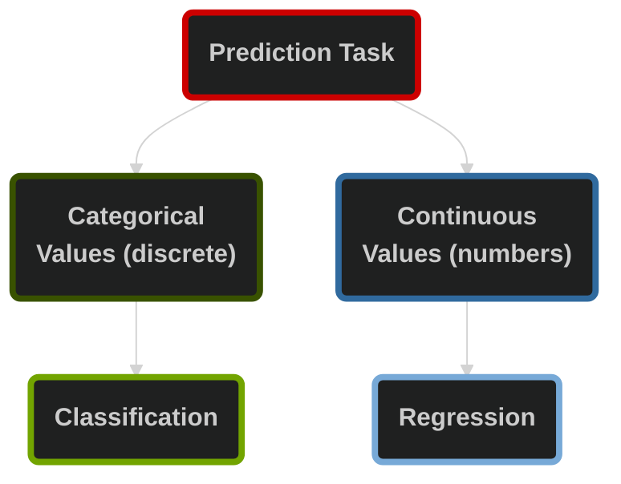

# Machine Learning Fundamentals & Data Preparation

## Table of Contents

1. [Core Concepts](#1-core-concepts)
2. [Machine Learning Applications](#2-machine-learning-applications)
3. [Supervised vs. Unsupervised Learning](#3-supervised-vs-unsupervised-learning)
4. [Classification vs. Regression](#4-classification-vs-regression)

## 1. Core Concepts

| Concept | Definition | Examples |
| --- | --- | --- |
| **Artificial Intelligence (AI)** | Broad field of computer science focused on creating systems that mimic human intelligence (reasoning, problem-solving, perception, decision-making) | Virtual assistants, recommendation systems |
| **Machine Learning (ML)** | A subset of AI where algorithms improve their performance by learning patterns from data, rather than being explicitly programmed with rules | Spam email detection, predictive maintenance |
| **Deep Learning (DL)** | A specialized branch of ML that uses multi-layered **artificial neural networks** to automatically learn complex representations from large datasets | Image recognition, speech-to-text |
| **Large Language Models (LLMs)** | Deep learning models trained on massive text datasets to understand, generate, and manipulate human language | ChatGPT, Perplexity, Claude |
| **Generative AI (GenAI)** | A class of AI systems designed to **create new content**: text, images, audio, video, or code—based on learned patterns from training data | DALL·E for images, Copilot for code/text |

[(back to top)](#table-of-contents)

## 2. Machine Learning Applications

| Sector | Applications |
| --- | --- |
| **Automotive Industry** | • Autonomous driving: object detection, lane recognition, decision-making |
| | • Predictive maintenance by monitoring car components |
| | • Smart infotainment: voice assistants, personalized navigation, gesture control |
| **Manufacturing (Industry 4.0)** | • Process optimization: reduce waste, improve efficiency |
| | • Quality control with ML-powered cameras |
| | • Adaptive robotics (machines learn new tasks) |
| **Finance & Banking** | • Fraud detection in real time | 
| | • Risk management |  
| | • Customer service via chatbots and assistants |
| **Healthcare** | • Medical imaging: tumor, fracture, heart condition detection |
| | • Personalized treatment: genetic and historical data |
| | • Hospital management: predict admissions, allocate resources |
| **Energy Sector** | • Smart grids: balance supply and demand |
| | • Renewables: forecasting solar, wind output |
| | • Predictive maintenance of turbines and solar farms |
| **Retail & E-commerce** | • Recommendation systems |
| | • Supply chain optimization" demand forecasting, stock management |
| | • Customer insights for targeted marketing |
| **Telecommunications** | • Network optimization: predict outages, improve performance |
| | • Churn prediction: proactive retention deals |
| **Research & Academia** | • Climate modeling and physics simulations |
| | • German Research Center for AI (DFKI) as a major hub |
| | • Corporate labs apply ML to their sectors: Zalando, Siemens, AstraZeneca |
| **Logistics & Transportation** | • Route optimization: reduce fuel, faster delivery |
| | • Predictive logistics: anticipate demand, manage fleets |
| **Government & Public Services** | • Smart cities: traffic, pollution, safety management |
| | • Cybersecurity: threat detection, system protection |
| | • Defense: simulations, strategic planning |
| **Daily Life Examples** | • Google Maps rerouting |
| | • Netflix & Spotify recommendations |
| | • Email spam filters |

[(back to top)](#table-of-contents)

## 3. Supervised vs. Unsupervised Learning

| Aspect | Supervised | Unsupervised |
| --- | --- | --- |
| **Training on** | Labeled datasets | Unlabeled datasets |
| **Outputs** | Input paired with correct output | No predefined outputs |
| **Goal** | Learn a mapping from inputs to outputs to make predictions on new data | Identify hidden patterns, structures, or relationships within the data |
| **Common Algorithms** | • Linear regression | • Clustering (k-means, hierarchical) |
| | • Decision trees | • Dimensionality reduction (PCA, t-SNE) |
| | • Neural networks | |

[(back to top)](#table-of-contents)

## 4. Supervised Learning

**Classification** predicts categories:

- Is an email spam or not?
- Predicting the winner of the next football match
- Which new leads are most likely to become paying customers?

**Regression** predicts numbers:

- What will the pric of this house be?
- How much revenue will a new lead generate in the first year?

[(back to top)](#table-of-contents)

## 5. Unsupervised Learning

**Clustering** groups similar thing together, such as:

- Segment customers by their shopping habits
- Discover hidden sub-groups withiin your existing customers

**Dimensionality Reduction** simplifies complex data by focusing on the most important features.

[(back to top)](#table-of-contents)
