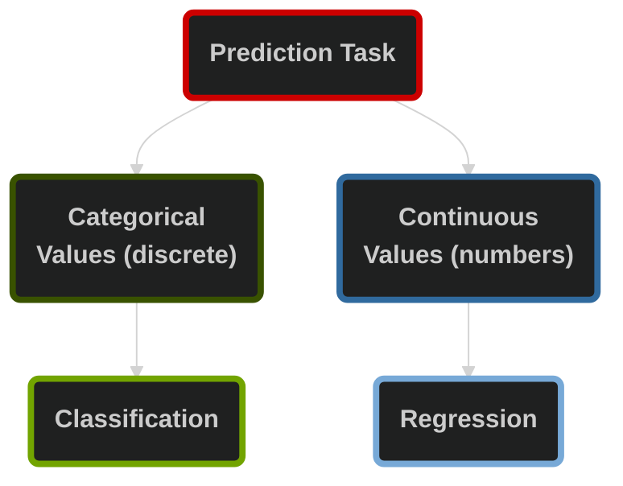

# Machine Learning Fundamentals & Data Preparation

## Table of Contents

1. [Core Concepts](#1-core-concepts)
2. [Machine Learning Applications](#2-machine-learning-applications)
3. [Supervised vs. Unsupervised Learning](#3-supervised-vs-unsupervised-learning)
4. [Supervised Learning](#4-supervised-learning)
5. [Unsupervised Learning](#5-unsupervised-learning)
6. [Data Science Lifecycle](#6-data-science-lifecycle)
7. [Why Data Types are Important](#7-why-data-types-are-important)
8. [Features Preparation](#8-features-preparation)
9. [Steps in Feature Preparation](#9-steps-in-feature-preparation)

## 1. Core Concepts

| Concept | Definition | Examples |
| --- | --- | --- |
| **Artificial Intelligence (AI)** | Broad field of computer science focused on creating systems that mimic human intelligence (reasoning, problem-solving, perception, decision-making) | Virtual assistants, recommendation systems |
| **Machine Learning (ML)** | A subset of AI where algorithms improve their performance by learning patterns from data, rather than being explicitly programmed with rules | Spam email detection, predictive maintenance |
| **Deep Learning (DL)** | A specialized branch of ML that uses multi-layered **artificial neural networks** to automatically learn complex representations from large datasets | Image recognition, speech-to-text |
| **Large Language Models (LLMs)** | Deep learning models trained on massive text datasets to understand, generate, and manipulate human language | ChatGPT, Perplexity, Claude |
| **Generative AI (GenAI)** | A class of AI systems designed to **create new content**: text, images, audio, video, or code—based on learned patterns from training data | DALL·E for images, Copilot for code/text |

[(back to top)](#table-of-contents)

## 2. Machine Learning Applications

## Automotive Industry

- Autonomous driving: object detection, lane recognition, decision-making
- Predictive maintenance by monitoring car components
- Smart infotainment: voice assistants, personalized navigation, gesture control

## Manufacturing (Industry 4.0)

- Process optimization: reduce waste, improve efficiency
- Quality control with ML-powered cameras
- Adaptive robotics (machines learn new tasks)

## Finance & Banking

- Fraud detection in real time
- Risk management  
- Customer service via chatbots and assistants

## Healthcare

- Medical imaging: tumor, fracture, heart condition detection
- Personalized treatment: genetic and historical data
- Hospital management: predict admissions, allocate resources

## Energy Sector

- Smart grids: balance supply and demand
- Renewables: forecasting solar, wind output
- Predictive maintenance of turbines and solar farms

## Retail & E-commerce

- Recommendation systems
- Supply chain optimization" demand forecasting, stock management
- Customer insights for targeted marketing

## Telecommunications

- Network optimization: predict outages, improve performance
- Churn prediction: proactive retention deals

## Research & Academia

- Climate modeling and physics simulations
- German Research Center for AI (DFKI) as a major hub
- Corporate labs apply ML to their sectors: Zalando, Siemens, AstraZeneca

## Logistics & Transportation-Route optimization: reduce fuel, faster delivery

- Predictive logistics: anticipate demand, manage fleets

## Government & Public Services

- Smart cities: traffic, pollution, safety management
- Cybersecurity: threat detection, system protection
- Defense: simulations, strategic planning

## Daily Life Examples

- Google Maps rerouting
- Netflix & Spotify recommendations
- Email spam filters

[(back to top)](#table-of-contents)

## 3. Supervised vs. Unsupervised Learning

| Aspect | Supervised | Unsupervised |
| --- | --- | --- |
| **Training on** | Labeled datasets | Unlabeled datasets |
| **Outputs** | Input paired with correct output | No predefined outputs |
| **Goal** | Learn a mapping from inputs to outputs to make predictions on new data | Identify hidden patterns, structures, or relationships within the data |
| **Common Algorithms** | Linear regression, decision trees, neural networks | Clustering (k-means, hierarchical), dimensionality reduction (PCA, t-SNE) |

[(back to top)](#table-of-contents)

## 4. Supervised Learning

**Classification** predicts categories:

- Is an email spam or not?
- Predicting the winner of the next football match
- Which new leads are most likely to become paying customers?

**Regression** predicts numbers:

- What will the price of this house be?
- How much revenue will a new lead generate in the first year?

[(back to top)](#table-of-contents)

## 5. Unsupervised Learning

**Clustering** groups similar thing together, such as:

- Segment customers by their shopping habits
- Discover hidden sub-groups within your existing customers

**Dimensionality Reduction** simplifies complex data by focusing on the most important features.

[(back to top)](#table-of-contents)

## 6. Data Science Lifecycle

| Nr | Step | Focus | What Happens | Example |
| --- | --- | --- | --- | ---|
| 1 | **Problem Definition** | Define the question | Frame a clear, measurable ML problem | Predict if a transaction is fraudulent in real time |
| 2 | **Data Collection** | Gather inputs | Collect relevant data from databases, APIs, sensors, logs, surveys | Customer history, demographics and support interaction for churn model |
| 3 | **Data Preparation** | Clean & format | Remove duplicates, fix errors, handle missing values, encode features, split into train/test sets | Transform emails into word counts for spam filter |
| 4 | **Data Exploration** | Understand data | Use stats and visualizations to correlations, anomalies and outliers | High support contacts → higher churn risk |
| 5 | **Model Building** | Train algorithms | Select and train models on training data, adjust parameters to minimize error | Logistic regression for churn prediction |
| 6 | **Model Evaluation** | Test performance | Evaluate on unseen test data with metrics: accuracy, precision, recall | Spam filter tested on new emails |
| 7 | **Model Deployment** | Real-world use | Deploy validated model, monitor, and retrain as data evolves | Netflix recommendation engine in production |

[(back to top)](#table-of-contents)

## 7. Why Data Types are important

**Data preparation** is a crucial step in Machine Learning and includes:

- Handling missing values
- Removing duplicates and errors
- Encoding categorical variables
- Scaling or normalizing numerical values
- Splitting data into training and test sets

We need to understand the type of data we're working with as _**each type requires different preprocessing methods**_.

| Data Type | Subtypes | Definition | Examples | Why It Matters |
| --- | --- | --- | --- | --- |
| **Numeric (Quantitative)** | Continuous | Any real value in a range | weight, height, temperature | Different scales can bias models unless normalized |
| | Discrete | Countable integers | number of products sold, customers in store | |
| **Categorical (Qualitative)** | Nominal | Unordered categories | gender, colors, product types | Must be encoded into numbers, and order matters for ordinal but not for nominal |
| | Ordinal | Ordered categories | education levels, ratings | |
| **Text** | — | Unstructured sequences of words o characters | Reviews, tweets, emails | Needs transformation into numeric features such as word counts |
| **Time Series** | — | Data collected at regular time intervals | Stock prices, sensor readings, sales over time | Order and temporal patterns (trends, seasonality) are crucial for predictions |
| **Boolean (Binary)** | — | 0/1 or True/False | Spam/not spam, pass/fail | Imbalanced classes can mislead models, e.g. if spam emails rare, model could cheat by always predicting "not spam" |
| **Image** | — | Pixel-based data (grayscale or RGB) | Photos, medical scans, satellite images | Requires specialized processing |

[(back to top)](#table-of-contents)  

## 8. Features Preparation

**Features** are the _inputs_ you give to a machine learning model so it can make predictions. They’re the measurable properties or characteristics that describe each data point. For example, when looking at **house prices**, features could be:

- size of the house,
- number of rooms,
- location, or
- year built.

**Feature preparation** transforms messy raw data into a clean, structured, and consistent form. This makes the model: learn faster, perform better, generalize to new data.

[(back to top)](#table-of-contents)

## 9. Steps in Feature Preparation

### Step 1 | Handling Missing Data

| **Why** | Most ML algorithms can’t handle missing data directly |
| --- | --- |
| **Handle** | • Drop rows/columns if only a few values are missing |
| | • Impute with mean/median (numeric), mode/“Unknown” (categorical) |
| | • Be mindful that dropping or imputation may introduce bias |

### Step 2 | Handling Outliers

| **Why** | Extreme values can distort statistics, mislead models and skew results |
| --- | --- |
| **Detect** | Boxplots, IQR method, Z-scores |
| **Handle** | • Remove (if errors) |
| | • Cap at thresholds (winsorization) |
| | • Transform (e.g., log) |
| | • Keep them if they are meaningful (e.g., fraud detection) |

### Step 3 | Handling Categorical Data

| **Why** | ML models need numbers, not strings |
| --- | --- |
| **Handle** | • Label encoding (ordinal features) |
| | • One-hot encoding (nominal features) |
| | $\quad$- `pd.get_dummies()` → fast prototyping |
| | $\quad$- `OneHotEncoder` → production-safe (handles unseen categories) |

### Step 4 | Feature Scaling

| **Why** | Many models are sensitive to feature magnitudes |
| --- | --- |
| **Handle** | • Normalization (Min-Max Scaling) |
| | $\quad$- rescales values to a fixed range (0,1) |
| | $\quad$- best when no outliers |
| | • Standardization (Z-score Scaling) |
| | $\quad$- rescales values to have mean=0, std=1 |
| | $\quad$- works well in most cases |
| **Not needed** | Tree-based models (Decision Trees, Random Forests, Gradient Boosted Trees) |

The key difference is:

- **Normalization** squeezes data into a fixed range, usually (0, 1)
- **Standardization** centers the data and rescales based on variance, but does not confine it to (0, 1)

### Step 5 | Feature Creation and Transformation

| **Why** | Raw data often doesn’t capture the full story and engineered features can boost performance |
| --- | --- |
| **Handle** | • Create new features |
| | $\quad$- Example: `FamilySize` = `SibSp`(siblings/spouses) + `Parch`(parents/children) |
| | • Transform skewed variables |
| | • Bin continuous values |
| | • Extract from strings/dates |
| | $\quad$- Example: `Title` from `Name` |

### Step 6 | Feature Selection

Details to follow later.

{add links to exercises and next section}

---

Proceed to next section:

[(back to top)](#table-of-contents)  
[(back to README)](/README.md)
